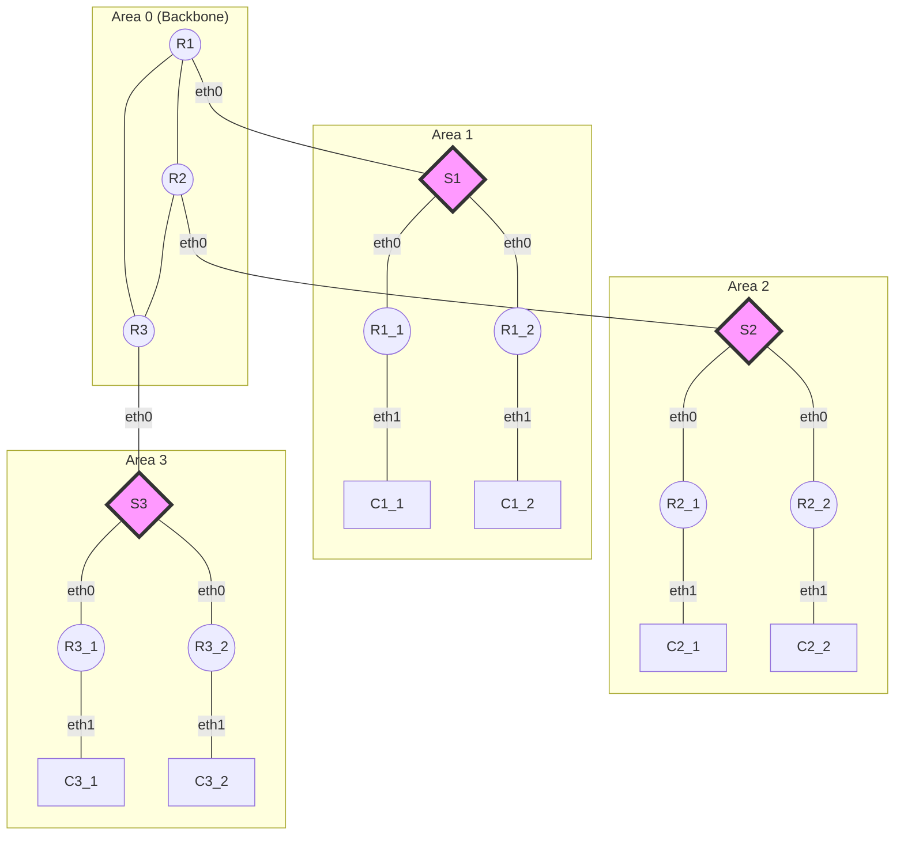

# Intra Domain Routing 

This repository contains a Python script (`ospf-lab.py`) that simulates an OSPF (Open Shortest Path First) network using Mininet. The script creates a topology with multiple routers and hosts, demonstrating both single-area and multi-area OSPF configurations.

## Requirements

- Python 3
- Mininet
- FRRouting (FRR)

## Usage

To run the OSPF lab simulation:

```bash
sudo python3 ospf-lab.py [options]
```

Options:
- `-g` or `--generateConfig`: Generate router configuration files (overwrites existing files)
- `-v` or `--verbose`: Print detailed logs during network creation and stop

## Topology

The script creates a network topology with three subnets, each containing a main router, two sub-routers, and two client hosts. The main routers are interconnected to form the backbone of the network.

### Multi-Area OSPF

In multi-area OSPF, the network is divided into multiple areas, with Area 0 serving as the backbone. This configuration improves scalability and reduces the processing load on routers.



## Network Components

- R1, R2, R3: Main routers (Area Border Routers in multi-area configuration)
- R1_1, R1_2, R2_1, R2_2, R3_1, R3_2: Sub-routers
- C1_1, C1_2, C2_1, C2_2, C3_1, C3_2: Client hosts
- S1, S2, S3: Switches connecting routers within each subnet

## Configuration

The script generates configuration files for each router using templates. These configurations are stored in the specified directory and are used to set up OSPF routing on the routers.

## Customization

You can modify the `OSPFLab` class in the script to adjust the network topology, IP addressing, or OSPF areas as needed for your specific requirements.

## Note

This lab is designed for educational purposes and may need additional configuration for production use. Ensure you have the necessary permissions and understanding of OSPF before deploying in a live environment.
